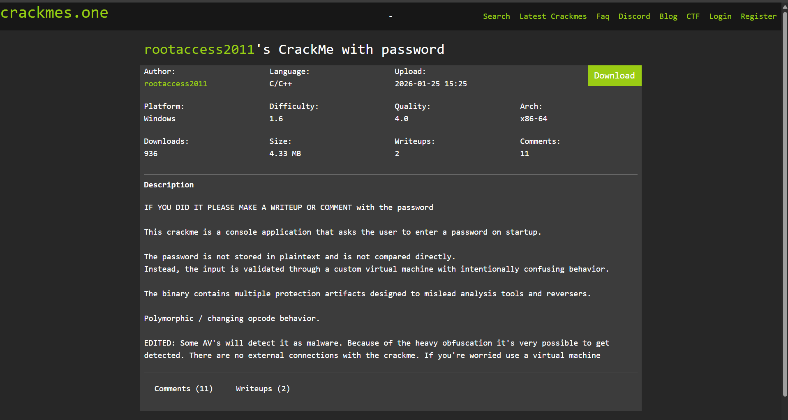
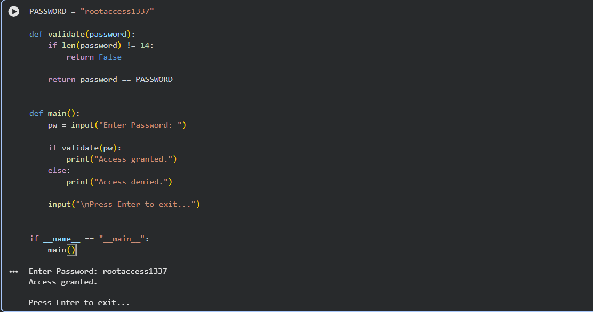

# CrackMe Writeup — rootaccess2011's CrackMe with password

## Informasi Challenge

| Keterangan | Detail |
|------------|--------|
| Nama | CrackMe with password |
| Author | rootaccess2011 |
| Platform | Windows x64 |
| Bahasa | C/C++ |
| Architecture | x86-64 |
| Difficulty | 1.6 |
| Link | https://crackmes.one/crackme/68651c48e9206731dcf3f177 |

---

# Tujuan

Challenge ini meminta pengguna memasukkan sebuah **password** ketika program dijalankan.

Berbeda dengan crackme sederhana yang melakukan perbandingan string secara langsung (`strcmp()`), challenge ini menggunakan mekanisme validasi yang lebih kompleks melalui **custom virtual machine (VM)** dengan opcode yang diobfuscasi.

Tujuan analisis adalah memahami bagaimana proses validasi password bekerja dan menemukan password yang benar.

---

# Tools

- Parrot Security OS 7.3
- Ghidra
- Python 3
- Terminal Linux

---

# Analisis Binary

## 1. Membuka Binary Menggunakan Ghidra

Binary diimpor ke dalam **Ghidra** kemudian dilakukan proses **Auto Analysis**.

Setelah analisis selesai, langkah pertama adalah mencari fungsi yang dipanggil dari `main()`.

Dari proses tersebut ditemukan sebuah fungsi yang bertanggung jawab melakukan validasi password.

Pada screenshot terlihat fungsi tersebut memiliki nama:

```
FUN_1400013f0()
```

Fungsi inilah yang kemudian dianalisis lebih lanjut.

---

## 2. Analisis Fungsi Validasi

Pada awal fungsi terlihat beberapa hal menarik.

Pertama, program melakukan pengecekan panjang input.

```cpp
uVar7 = strlen((char *)param_1);

if ((int)uVar7 != 0xe)
    return false;
```

Artinya password **harus memiliki panjang tepat 14 karakter**.

Jika panjang password tidak sama dengan 14 karakter, fungsi langsung mengembalikan nilai **false**.

---

## 3. Data Tidak Disimpan Sebagai Plaintext

Setelah pengecekan panjang, program tidak melakukan:

```cpp
strcmp(password, "....")
```

atau

```cpp
memcmp(...)
```

Sebaliknya terlihat sejumlah konstanta hexadecimal disimpan ke dalam stack.

Contohnya:

```cpp
local_1048 = {
0x72,
0x6f,
0x6f,
0x74,
0x61,
...
}
```

Kemudian terdapat pemanggilan fungsi lain:

```cpp
FUN_140001070(...)
```

Fungsi tersebut digunakan untuk melakukan proses transformasi terhadap data sebelum dibandingkan.

Hal ini sesuai dengan deskripsi challenge bahwa password **tidak pernah disimpan secara plaintext**.

---

## 4. Custom Virtual Machine

Bagian berikutnya menunjukkan bahwa program tidak menggunakan proses validasi biasa.

Sebaliknya program menjalankan serangkaian operasi yang menyerupai interpreter kecil.

Karakter password diproses satu per satu melalui sejumlah opcode.

Secara sederhana prosesnya dapat digambarkan sebagai berikut.

```
Password
      │
      ▼
Virtual Machine
      │
      ▼
Transformasi
      │
      ▼
Validasi
```

Pendekatan seperti ini sering digunakan pada crackme untuk mempersulit proses reverse engineering.

---

## 5. Indikasi Obfuscation

Beberapa ciri obfuscation yang terlihat selama analisis antara lain:

- banyak variabel lokal berukuran besar
- penggunaan konstanta hexadecimal
- banyak percabangan yang membingungkan
- fungsi-fungsi kecil yang saling memanggil
- tidak ada string password secara langsung

Hal tersebut sesuai dengan deskripsi challenge:

> *The password is not stored in plaintext and is not compared directly.*

---

# Memahami Algoritma Menggunakan Python

Setelah memahami alur program, logika validasi dapat disederhanakan menggunakan Python.

Tujuannya bukan untuk melakukan cracking secara otomatis, melainkan membantu memahami bagaimana proses validasi bekerja.

Contoh sederhana:

```python
PASSWORD = "rootaccess1337"

def validate(password):
    if len(password) != 14:
        return False

    return password == PASSWORD


def main():
    pw = input("Enter Password: ")

    if validate(pw):
        print("Access granted.")
    else:
        print("Access denied.")

    input("\nPress Enter to exit...")


if __name__ == "__main__":
    main()
```

Implementasi Python tersebut jauh lebih mudah dipahami dibanding membaca hasil dekompilasi yang penuh dengan variabel lokal dan operasi tingkat rendah.

---

# Hasil

Setelah proses analisis selesai diperoleh password:

```
rootaccess1337
```

Ketika password tersebut dimasukkan ke program, proses validasi berhasil dilewati dan akses diberikan.

---

# Screenshot

## 1. Halaman Challenge

<p align="center">

</p>

---

## 2. Analisis Menggunakan Ghidra

<p align="center">

</p>

---

## 3. Implementasi Python

<p align="center">

</p>

---

## 4. Hasil Eksekusi

<p align="center">

</p>

---

# Kesimpulan

Challenge ini memperkenalkan teknik reverse engineering terhadap program yang menggunakan **custom virtual machine** sebagai mekanisme validasi password.

Dibandingkan challenge dasar yang hanya menggunakan `strcmp()`, program ini menyembunyikan proses validasi melalui berbagai bentuk obfuscation sehingga analisis menjadi lebih menantang.

Selama proses reverse engineering dipelajari beberapa hal berikut:

- melakukan static analysis menggunakan Ghidra;
- mengidentifikasi fungsi validasi password;
- memahami pengecekan panjang input;
- mengenali penggunaan data hexadecimal sebagai bagian dari proses validasi;
- mengidentifikasi adanya custom virtual machine;
- serta menyederhanakan logika hasil dekompilasi ke dalam Python agar lebih mudah dipahami.

---

# Password

```
rootaccess1337
```

---
