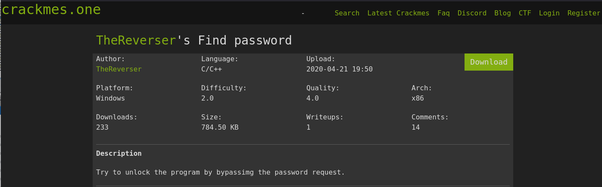

# CrackMe Writeup — TheReverser's Find Password

## Informasi Challenge

| Keterangan | Detail |
|------------|--------|
| Nama | Find password |
| Author | TheReverser |
| Platform | Windows |
| Bahasa | C/C++ |
| Architecture | x86 |
| Difficulty | 2.0 |
| Link | https://crackmes.one/crackme/5e9f1eeb33c5d42a7c6676a4 |

---

# Tujuan

Challenge ini meminta pengguna untuk membuka program dengan melewati proses validasi password.

Berbeda dengan challenge yang menggunakan algoritma validasi yang kompleks, pada challenge ini password sebenarnya masih tersimpan di dalam binary sehingga dapat ditemukan melalui proses static analysis menggunakan Ghidra.

Tujuan analisis adalah mengidentifikasi lokasi password tersebut dan menggunakannya untuk membuka program.

---

# Tools

- Parrot Security OS 7.3
- Ghidra
- Terminal Linux

---

# Analisis Binary

## 1. Membuka Binary Menggunakan Ghidra

Binary diimpor ke dalam **Ghidra** kemudian dilakukan proses **Auto Analysis**.

Setelah proses analisis selesai, langkah pertama adalah melihat isi program melalui **Program Tree**, khususnya pada bagian:

```
.data
.rdata
```

Karena challenge memiliki tingkat kesulitan yang rendah, besar kemungkinan password disimpan sebagai string biasa.

---

## 2. Melihat Daftar Strings

Langkah berikutnya adalah membuka menu:

```
Search
    └── For Strings
```

atau menggunakan **Defined Strings** pada Ghidra.

Dari hasil pencarian ditemukan beberapa string yang digunakan oleh program.

Di antaranya terdapat string yang tampak mencurigakan, yaitu:

```
djejie
```

String tersebut berada pada section **.data** dan direferensikan oleh fungsi validasi password.

---

## 3. Menganalisis Referensi String

Setelah memilih string tersebut kemudian dilakukan proses:

```
Show References To
```

atau menekan shortcut **X** pada Ghidra.

Dari referensi tersebut terlihat bahwa string digunakan oleh fungsi yang melakukan proses pemeriksaan password.

Pada pseudocode decompiler terlihat fungsi melakukan pemanggilan seperti:

```cpp
memcmp(...)
```

atau fungsi pembanding string lainnya terhadap input pengguna.

Karena string sudah tersimpan secara langsung di dalam binary, proses reverse engineering menjadi jauh lebih sederhana.

---

## 4. Verifikasi Password

Program kemudian dijalankan.

Saat password:

```
djejie
```

dimasukkan, program berhasil melewati proses validasi dan memberikan akses.

Hal ini menunjukkan bahwa password memang disimpan secara langsung di dalam binary tanpa mekanisme enkripsi ataupun obfuscation.

---

# Hasil

Password yang berhasil ditemukan adalah:

```
djejie
```

Password tersebut diperoleh melalui proses static analysis menggunakan Ghidra tanpa perlu melakukan debugging ataupun patching binary.

---

# Screenshot

## 1. Halaman Challenge

<p align="center">

</p>

---

## 2. Analisis Menggunakan Ghidra

<p align="center">

</p>

---

## 3. Daftar Strings

<p align="center">

</p>

---

# Kesimpulan

Challenge ini merupakan latihan dasar reverse engineering yang berfokus pada penggunaan **static analysis** menggunakan Ghidra.

Karena password masih disimpan sebagai plaintext di dalam binary, proses analisis dapat dilakukan hanya dengan memeriksa daftar string dan melihat referensi penggunaannya pada fungsi validasi.

Selama proses reverse engineering dipelajari beberapa hal berikut:

- melakukan static analysis menggunakan Ghidra;
- memahami struktur section pada binary;
- menggunakan fitur **Defined Strings**;
- mencari referensi (XREF) suatu string;
- mengidentifikasi fungsi validasi password;
- serta menemukan password tanpa perlu melakukan patching maupun debugging.

---

# Password

```
djejie
```
